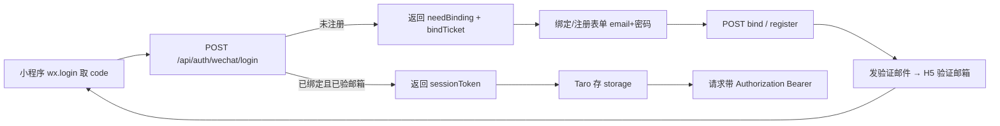

# 微信小程序完整使用体验 —— 实施方案

> 读者：店主（单人实施视角）
> 状态：方案稿（待确认清单见 §8）
> 日期：2026-08-14
> 范围：只写方案，不涉及代码改动

---

## 1. 结论与路线

**一句话结论：搬 UI 不搬数据。** 小程序端用 Taro（React 语法）原生重写 UI，业务与数据全部复用现有 Next.js 服务端 API（Next.js 变为 headless backend），浏览器专属功能用 web-view 兜底。

| 决策项 | 结论 | 理由 |
|---|---|---|
| 前端技术 | Taro（React 语法） | 与现有 React 19 心智一致，一套代码可复用 `src/data/*.ts` 纯 TS 数据源与 i18n 消息 |
| 后端 | Next.js 变 headless backend，API 层零框架改动 | 30+ 个依赖 `getSession()` 的 route handler 通过 Bearer→Cookie 桥接零改造复用 |
| 浏览器专属功能 | web-view 兜底 | 站内应用、产品演示 iframe、Tollow 大文件处理、管理后台只能跑在真实浏览器上下文 |
| 内容安全 | 微信 `msgSecCheck` / `imgSecCheck` 接入 | 小程序上架合规必做 |

**路线三支柱：**
1. **Taro 原生 UI**：Tab 四页（首页 / 博客 / 产品 / 我的）+ 分包，设计系统从 `globals.css` 迁移到 WXSS。
2. **复用服务端 API**：新增/改造少量 API（微信登录、JSAPI 支付、内容与商业只读 API、下载 JSON 变体），支付回调与履约、授权核心零改动。
3. **web-view 兜底**：仅 4 类场景走 web-view，不把整个站点塞进 web-view（包体验、审核风险均不可控）。

**总工期：单人 7-10 周；双人并行（后端 1 + 小程序 1）约 4-5 周。**

---

## 2. 现状盘点

### 2.1 可直接复用（零改造）

| 分类 | API / 模块 | 说明 |
|---|---|---|
| 内容互动 | `GET/POST /api/comments`、`GET/POST /api/likes`、`GET/POST /api/blog/favorites` | 评论 / 点赞 / 收藏 |
| 内容互动 | `POST /api/reports`、`POST /api/post-stats` | 举报、文章统计聚合（6 查询并行） |
| 内容互动 | `GET /api/spotlight/search?q=&locale=`、`GET /api/help-panel?slug=&locale=` | 搜索、帮助面板 |
| 内容互动 | `POST /api/topics/propose`、`POST /api/feedback` | 选题提议、反馈 |
| 商业 | `GET /api/entitlements`、`GET /api/pass/status` | 授权、Pass 状态 |
| 商业 | `POST /api/claim`（免费入库）、`POST /api/invite/redeem` | 免费领取、邀请码兑换 |
| 商业 | `GET /api/payment?orderId&token` | 支付状态轮询 |
| 支付履约 | `/api/payment/wechat/notify`、`/api/payment/alipay/notify`、`src/lib/order-fulfillment.ts` | JSAPI 回调与 native/h5 同构，零改动 |
| 授权核心 | `getUserEntitlements`（管理员 / 已支付订单 / 已兑换邀请码）、`accumulatePass`、单品优先于 Pass | 授权判定与小程序共用 |

### 2.2 必须新增 / 改造（核心缺口）

| # | 缺口 | 现状 | 方案 |
|---|---|---|---|
| 1 | 微信登录 | 仓库无 openid/oauth 体系；`users` 表 email/password_hash 均 NOT NULL | users 加 `wechat_openid`（+可选 `wechat_unionid`）；新增登录 / 绑定 / 注册三端点 |
| 2 | 会话桥接 | 会话是 httpOnly cookie `ms_session`，`wx.request` 不自动管理 cookie | 登录返回 JWT 字符串，Taro 存 storage，请求带 `Authorization: Bearer`，`src/proxy.ts` 做 Bearer→Cookie 搬运 |
| 3 | JSAPI 支付 | `src/lib/wechat.ts` 只有 native/h5 分支 | 新增 `channel:'jsapi'` + paySign helper；H5 支付在小程序内不可用，只能 JSAPI |
| 4 | 内容只读 API（最大缺口） | 博客无公共 JSON/HTML 读接口，详情是 SSR | 新增列表 / 详情 / HTML / 分区 / 标签 / 收藏 6 个接口 |
| 5 | 商业只读 API | 产品与订单数据无独立 JSON 接口 | 新增 `GET /api/products`、`GET /api/orders`、`GET /api/orders/[id]` |
| 6 | 下载「扫码/复制到电脑」 | `/api/download` 是 302 + cookie 会话，小程序端不可用 | 新增 `format=json` 变体返回 5 分钟 TTL signedUrl，渲染二维码或复制链接 |
| 7 | 内容安全 | 无微信内容安全接入 | 新增 `src/lib/wechat-security.ts`，接入评论 / 投稿 / 图片上传 |
| 8 | 限流 | 小程序流量经微信出口 IP 高度集中，纯 IP 限流可能误伤 | 登录接口优先 userId 维度或先观察再放宽，勿破坏现有键 |

---

## 3. 架构设计

### 3.1 总体架构与 monorepo 目录

```
meteor-store/
├── src/                      # 现有 Next.js（headless backend）
│   ├── app/api/              # 30+ route handler，基本零改造
│   ├── proxy.ts              # Next.js 16 middleware 替代品（需扩展 Bearer 桥接）
│   ├── lib/                  # wechat.ts / wechat-miniapp.ts / wechat-security.ts / order-fulfillment.ts …
│   └── data/                 # products / pass / blog-sections / help-articles / faqs（纯 TS，可被小程序复用）
├── messages/                 # zh.json / en.json（按命名空间裁剪后进小程序）
└── miniprogram/              # 新增：Taro 小程序（pnpm workspace 隔离）
    ├── src/
    │   ├── app.config.ts     # 固定暗色：backgroundColor #000、navigationBarTextStyle white
    │   ├── app.wxss          # 从 globals.css 迁移的 token 与字阶（oklch→hex/rgb，clamp→rpx）
    │   ├── pages/            # Tab 四页 + 分包页
    │   └── utils/i18n.ts     # ~20 行 t(key, vars) 工具
    └── project.config.json
```

**复用约定：**
- 纯 TS 数据源（`src/data/*.ts`）直接复用，不复制粘贴，保证价格 / 分区 / 权益单一数据源。
- `messages/zh.json`、`messages/en.json` 约 90KB/个，按命名空间裁剪后按需分包，主包控制在 2MB 内。
- 写一个 ~20 行 `t(key, vars)` 工具即可，不需要 next-intl。

### 3.2 认证与会话（微信登录 + Bearer 桥接）

**数据模型：**

```ts
// users 表迁移（Drizzle）
users: {
  // ...现有字段
  wechatOpenid: text('wechat_openid').unique(), // 可空，绑定时写入
  wechatUnionid: text('wechat_unionid'),        // 可选
}
```

**三个新端点：**

| 端点 | 行为 |
|---|---|
| `POST /api/auth/wechat/login` | `code` → `jscode2session` → `openid`；已绑且 `emailVerified` 则签会话；未注册返回 `needBinding` + `bindTicket` |
| `POST /api/auth/wechat/bind` | `bindTicket` + email + 密码验密，条件更新 `WHERE wechat_openid IS NULL` 防抢绑，命中 0 行返回 409 |
| `POST /api/auth/wechat/register` | `bindTicket` + email + 密码，`emailVerified=false` 建号 + 发验证邮件，**不签会话** |

**bindTicket：** Redis 一次性票据，`key=wechat:bind:{openid}`，TTL 10 分钟，消费即删。

**emailVerified 铁律不破：** 微信只是身份提供者，正式身份仍是已验证邮箱。新用户流程是「绑定/注册 → 邮箱验证（H5 兜底）→ 回小程序登录」，验证邮件里给 H5 验证链接。



**Bearer→Cookie 桥接（`src/proxy.ts`）：**

现有 `proxy.ts` 的 matcher 排除了 `/api`（见源码 `'/((?!api|...))'`），需扩展为 `/api/*` 也走 proxy，把 Bearer 头搬运成 `ms_session` cookie，让 30+ 个依赖 `getSession()` 的 route handler 零改造。

```ts
// src/proxy.ts 扩展示意
if (pathname.startsWith('/api/')) {
  const auth = request.headers.get('authorization');
  if (auth?.startsWith('Bearer ')) {
    const token = auth.slice(7);
    requestHeaders.set('cookie', `ms_session=${token}`);
  }
  return NextResponse.next({ request: new NextRequest(request, { headers: requestHeaders }) });
}
```

CSRF 无影响（`wx.request` 不带 Origin 自动放行）；保险起见把 `https://servicewechat.com` 加入 `buildAllowedOrigins`。

### 3.3 JSAPI 支付链路

- `src/lib/wechat.ts` 目前只有 native/h5 分支，需扩展 `createWechatOrder` 增加 `channel:'jsapi'`，调用 `POST /v3/pay/transactions/jsapi`，body 加 `payer:{openid}`；**appid 必须与 openid 同属一个小程序且商户号已绑定**。注意 **v3 没有 trade_type 字段，渠道由端点路径区分**。
- 新增 paySign helper（签名串与 `buildAuthHeader` 消息格式不同，不能复用）：

```ts
// paySign：timeStamp\nonceStr\npackage=prepay_id=xxx\n 用商户 API 私钥 RSA-SHA256
const message = `${appid}\n${timeStamp}\n${nonceStr}\nprepay_id=${prepayId}\n`;
const paySign = crypto.sign('sha256', Buffer.from(message), merchantApiPrivateKey).toString('base64');
// 返回 { timeStamp, nonceStr, package: 'prepay_id=xxx', signType: 'RSA', paySign }
```

- `POST /api/payment` 增加 `channel:'jsapi'` 分支返回 payParams；**PaymentSchema 的 email 放宽为登录态可省略**（`session.email` 兜底，否则小程序用户必须先绑邮箱才能下单）。
- 前端流程：`wx.login` → code → openid → 下单 → `Taro.requestPayment` → 轮询 `GET /api/payment?orderId&token`。
- 回调 `/api/payment/wechat/notify` 与履约 `src/lib/order-fulfillment.ts` 零改动。

### 3.4 内容只读 API（最大缺口）

| 端点 | 说明 |
|---|---|
| `GET /api/blog/posts?locale=&section=&tag=&limit=&cursor=` | 列表分页；服务端走 `getFeedPostsBySection` / `getFeedPostsByTag` + `toFeedSummary`，**不下发 content 全文**（建议补 DB 侧 summary 查询） |
| `GET /api/blog/posts/{targetId}?locale=` | 详情 JSON；targetId 兼容文件 slug 与投稿 base64url id，`published` 才公开 |
| `GET /api/blog/posts/{targetId}/html?locale=` | `markdownToHtml` 渲染好的 sanitize HTML，供小程序 rich-text，可附 headings |
| `GET /api/blog/sections?locale=` | 分区列表 |
| `GET /api/blog/tags?locale=` | 标签索引 |
| `GET /api/blog/favorites/posts?locale=` | 复用 `getUserFavoritePosts` |

**必须遵守项目约定：** 读只从 `src/data/blog-feed.ts` 合并层取（直接 import `blogPosts` 会静默漏掉读者投稿）；`href` 由服务端决定，不自己拼 `/blog/${slug}`；传给客户端前过 `toFeedSummary()` 白名单，正文不进客户端 bundle。

### 3.5 商业只读 API

| 端点 | 说明 |
|---|---|
| `GET /api/products?locale=` | `localizeProducts` 拍平；**绝不下发 r2Key**；downloads 只给 id/label/icon/gated/version/sha256/url 外链；pricing 全量；Pass 单独展示不进产品列表（语义按 `findPurchasable`） |
| `GET /api/orders` | 复用 `/orders` 页查询逻辑 |
| `GET /api/orders/[id]` | 返回 status/deliveryStatus/amountCny/planName/productId/paidAt/licenseKey；`findPurchasable` 取名；订单详情带授权码 |

### 3.6 下载「扫码 / 复制到电脑」

`/api/download` 目前是 302 + cookie 会话，小程序端不可行。改造为：

- `GET /api/download/{productId}?file=xxx&format=json`：服务端校验授权后返回 5 分钟 TTL 的 signedUrl（复用 `createSignedReleaseUrl`）。
- 小程序渲染成二维码（建议新增服务端 `GET /api/qr?text=`，用现有 sharp 生成 PNG，省小程序包体），或 `wx.setClipboardData` 复制链接。
- 可选进阶方案：一次性 ticket 链接。
- **不破坏门控原则**：安装包路径仍不进页面、不落地公开 URL，免费产品同样走预签名。

### 3.7 设计系统迁移

- `globals.css` 的 `:root:root` 暗色 token 与 `t-*` 字阶（t-display / t-title-1/2/3/4 / t-body / t-footnote / t-eyebrow 四元组：字号/字重/行高/字距）整体搬进 `app.wxss`。
- **oklch 预编译成 hex/rgb 常量**；**clamp/vw 流式字号改成固定 rpx 档位**（按 375px 档换算，如 30px = 60rpx）。
- **backdrop-filter 玻璃材质 WXSS 不支持**，重画为「半透明深紫渐变 + 白微边 + 内阴影」实色面板（等价于 prefers-reduced-transparency 分支）；hover / 鼠标追踪 / 镜面高光删除。
- 动画 keyframes 可保留但去掉 `prefers-reduced-motion`（小程序固定关闭或手动关）。
- 暗色约定：`app.config.ts` 固定 `backgroundColor #000`、`navigationBarTextStyle white`，**不启用 darkmode 跟随系统**（与全站只有暗色一套一致）；`--blog-accent` 分区主题色沿用 rgb 注入。

---

## 4. 小程序页面地图

### 4.1 Tab 四页（主包）

| Tab | 页面 | 主要能力 |
|---|---|---|
| 首页 | 首页 | 头条/分区入口、Pass 定价（三档）、活动位 |
| 博客 | 博客列表 / 详情 / 搜索 | 分区筛选、标签、文章详情（rich-text）、搜索（spotlight API）、我的投稿、投稿表单（textarea + Markdown 预览，图片 `wx.uploadFile` 走现有 multipart 接口）、我的收藏 |
| 产品 | 产品列表 / 详情 / 定价 | JSAPI 购买、免费领取（`/api/claim`）、兑换邀请码、我的产品（entitlements）、订单列表 / 详情（授权码复制）、下载（二维码 / 复制链接） |
| 我的 | 个人中心 | 微信登录 / 绑定 / 注册、昵称 / bio / 头像 base64 上传、改密、数据导出、帮助中心（help-panel HTML） |

### 4.2 分包

| 分包 | 页面 |
|---|---|
| 博客详情 | 文章详情（rich-text）、投稿表单、我的投稿、我的收藏 |
| Web-view | 4 个站内应用、产品演示、Tollow 大文件处理、管理后台 |
| 法务 | 隐私协议、用户协议、帮助中心 |

### 4.3 web-view 兜底清单

| 场景 | 兜底原因 | 目标路由 |
|---|---|---|
| 4 个站内应用（webgl-fluid-sim / skeleton-anatomy / chakra-visualizer / tollow） | 需要真实浏览器（WASM/Canvas/手势） | `/apps/{id}/trial` 免门控同源路由 |
| 产品演示 iframe | iframe 无法在小程序内渲染 | 产品详情页演示区 |
| Tollow 大文件处理 | 小程序包体与存储限制 | Tollow 对应页面 |
| 管理后台 `/admin` | 仅 web-view，cookie 登录在真实浏览器上下文可用 | `/admin` |

### 4.4 其他要点

- 滑块验证码在 Taro 里用 `view + touch` 重写，**协议不变**（仍走 `/api/captcha/verify` 换 proof）。
- 包体控制：主包只放 Tab 页，博客详情 / web-view / 法务走分包。

---

## 5. 后端新增 / 改造 API 清单

| 端点 | 改动类型 | 涉及文件 / 模块 |
|---|---|---|
| `POST /api/auth/wechat/login` | 新增 | `src/lib/wechat-miniapp.ts`（jscode2session）、`src/lib/auth/*` |
| `POST /api/auth/wechat/bind` | 新增 | users 表迁移（`wechat_openid` UNIQUE）、Redis bindTicket |
| `POST /api/auth/wechat/register` | 新增 | 同上 + 发验证邮件 |
| `src/proxy.ts` | 改造 | matcher 扩展 `/api/*`，Bearer→Cookie 搬运；`buildAllowedOrigins` 加 servicewechat.com |
| `POST /api/payment` | 改造 | `channel:'jsapi'` 分支 + payParams；PaymentSchema email 放宽 |
| `src/lib/wechat.ts` | 改造 | `createWechatOrder` 增加 jsapi 端点；新增 paySign helper |
| `GET /api/blog/posts` | 新增 | 走 `src/data/blog-feed.ts` + `toFeedSummary` |
| `GET /api/blog/posts/{targetId}` | 新增 | 详情 JSON |
| `GET /api/blog/posts/{targetId}/html` | 新增 | `markdownToHtml` + sanitize |
| `GET /api/blog/sections` | 新增 | `src/data/blog-sections.ts` |
| `GET /api/blog/tags` | 新增 | `src/data/blog-feed.ts` 标签索引 |
| `GET /api/blog/favorites/posts` | 新增 | 复用 `getUserFavoritePosts` |
| `GET /api/products` | 新增 | `localizeProducts` 拍平；不下发 r2Key |
| `GET /api/orders`、`GET /api/orders/[id]` | 新增 | 复用 `/orders` 页查询逻辑 |
| `GET /api/download/[productId]?format=json` | 改造 | 返回 signedUrl；复用 `createSignedReleaseUrl` |
| `GET /api/qr?text=` | 新增 | 用现有 sharp 生成 PNG |
| `src/lib/wechat-security.ts` | 新增 | `msgSecCheck` / `imgSecCheck` |
| 评论 / 投稿 / 图片上传接口 | 改造 | 接入内容安全：`POST /api/comments`、`POST/PATCH /api/posts`、v1 blog posts submit、`/api/v1/blog/images`、`/api/blog/upload-image` |

---

## 6. 安全与合规

1. **emailVerified 铁律不破**：微信只是身份提供者，正式身份仍是已验证邮箱；`getSession()` 同时校验 `tokenVersion` 与数据库 `emailVerified`，未验证旧会话立即失效。
2. **openid 防抢绑**：绑定用条件更新 `WHERE wechat_openid IS NULL`，命中 0 行返回 409；bindTicket 一次性、TTL 10 分钟。
3. **内容安全（上架必做）**：`src/lib/wechat-security.ts` 调 `security.msgSecCheck`（文本，场景 comment/post）与 `imgSecCheck`（图片）；命中直接 400/451 不入库。**注意现有 `src/lib/wechat.ts` 是微信支付商户侧 appid，不能混用，安全检测用小程序 appid/secret。**
4. **密钥管理**：新增 env `WECHAT_MINI_APPID`、`WECHAT_MINI_SECRET`（敏感，只进 Vercel 环境变量，不进仓库）。
5. **小程序备案**：2023 年起小程序也要备案；web-view 业务域名需配置校验文件。
6. **下载门控**：安装包不进页面、不落地公开 URL；signedUrl 5 分钟 TTL；免费产品同样走预签名。

---

## 7. 阶段路线图（单人时间表）

| Phase | 内容 | 工期 | 验证方式 |
|---|---|---|---|
| **Phase 0 后端地基** | 微信登录三件套 + users 迁移 + proxy Bearer 桥接 + JSAPI 支付 + 内容/产品/订单只读 API + msgSecCheck + CSRF 白名单 + email 放宽 + 下载 json 变体 | 2-3 周 | vitest 单测 + 微信开发者工具联调（dev 用「不校验合法域名」） |
| **Phase 1 MVP** | Taro 脚手架 + 设计 token 迁移 + 首页/博客列表/文章详情/搜索 + 微信登录绑定 + 定价/JSAPI 买 Pass + 我的产品/订单/授权码 | 2-3 周 | 体验版走通「微信登录 → 买 Pass → 我的产品」闭环 |
| **Phase 2 完整功能** | 评论/点赞/收藏/举报 + 投稿（含图片上传）+ 兑换/免费领取 + 下载扫码/复制 + 个人中心 | 2-3 周 | 与 Web 端功能对照清单逐项勾 |
| **Phase 3 上线合规** | web-view 业务域名、小程序备案、隐私协议与用户协议（现有 /privacy /eula 内容）、类目选择、内容安全联调、测试账号、提审、灰度发布（先体验版再正式版） | 1 周 | 提审通过 + 正式版灰度 |

**合计：单人 7-10 周；双人并行（后端 1 + 小程序 1）约 4-5 周。**

---

## 8. 待确认清单（外部事实，需人工核对）

| # | 待确认项 | 影响 |
|---|---|---|
| 1 | `WECHAT_APPID` 是公众号还是小程序 appid | 支付 / 登录 / 安全检测的 appid 均需正确 |
| 2 | 商户号是否已绑定小程序 appid 并开通 JSAPI 支付 | JSAPI 支付前置条件 |
| 3 | 小程序主体注册（个体户「广州市番禺区流星软件店」）是否已有小程序账号 | 提审与主体一致性 |
| 4 | imagentx.top 备案状态与小程序自身备案 | 2023 年起小程序也要备案，web-view 域名需备案 |
| 5 | 生产环境 `SHOW_PRICING` 是否 true | false 时支付接口返回 503 |
| 6 | **AGENTS.md 写 Pass ¥39/¥299/¥899，但代码 `src/data/pass.ts` 实际是 ¥9/¥19/¥99（测试钉住 annual=19）** | 文档与代码不一致，方案按代码为准，需店主确认最终定价 |
| 7 | **AGENTS.md 说还没有产品配 r2Key，但代码 statux/xisland/xnook 已配** | 同样不一致，方案按代码为准 |

---

## 9. 风险与工作量估算

| 风险 | 等级 | 说明 / 缓解 |
|---|---|---|
| web-view 政策变化 | 中 | web-view 仅兜底 4 类场景，若政策收紧可逐步替换 |
| 审核被拒（纯壳类目） | 中 | 内容安全 + 隐私协议 + 类目选择前置到 Phase 3 之前联调 |
| H5 支付禁域名单 | 低 | 小程序内不走 H5 支付，主要影响 web-view 里的收银台（本方案小程序内全走 JSAPI） |
| 小程序流量 IP 集中触发限流 | 中 | 登录接口优先 userId 维度或先观察再放宽；改动谨慎，勿破坏现有键 |
| 主包超 2MB | 中 | 主包只放 Tab 页，详情/web-view/法务分包；i18n 按命名空间裁剪 |
| 价格/数据源不一致 | 高（先确认） | §8 待确认清单 #6/#7，按代码为准并请店主确认 |

**工作量估算：**

| 方式 | 工期 |
|---|---|
| 单人 | 7-10 周（Phase 0-3） |
| 双人并行（后端 1 + 小程序 1） | 约 4-5 周 |

---

## 附：实施顺序建议

1. 先做 Phase 0 后端地基并补齐 §8 待确认清单（支付、备案、主体）。
2. Phase 1 MVP 走通「微信登录 → 买 Pass → 我的产品」闭环，尽早拿到体验版。
3. Phase 2 功能对照 Web 端逐项补齐。
4. Phase 3 上线合规（备案、内容安全、提审、灰度）。
