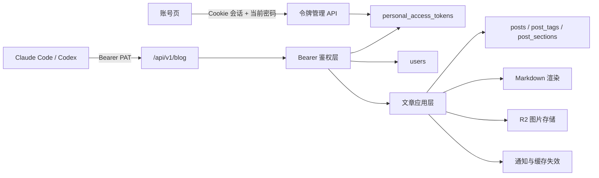

# Meteor Store 博客发布 API 设计

- 日期：2026-08-10
- 状态：已实现并通过全量验证
- 目标读者：Meteor Store 维护者、API 使用者、实现该功能的开发代理

## 背景

Meteor Store 目前有两条文章来源：

1. 站主文件文章位于 `content/blog/*.md`，依赖 Git 和部署发布。
2. 用户投稿存放在数据库 `posts` 表，已经具备 Markdown、草稿、审核、发布、图片上传、预览和缓存失效链路。

Claude Code、Codex 等本地开发代理无法安全复用浏览器 Cookie，也不应获得用户密码、仓库写权限或管理员全局密钥。为了让这些工具帮助用户处理 Markdown 排版并发布文章，需要增加一套独立、可撤销、最小权限的个人访问令牌和稳定的 REST API。

本设计复用现有数据库投稿模型，不新增第三套文章来源。通过 API 发布的文章使用现有 `/blog/p/{id}` 地址。

## 目标

- 所有邮箱已验证用户都能创建多枚博客个人访问令牌。
- 令牌可以单独命名、授权、过期和撤销，明文只显示一次。
- Claude Code、Codex 等客户端可以完成“创建草稿、修改 Markdown、预览、显式提交”的闭环。
- 普通用户提交后进入现有审核队列；管理员提交自己的文章时直接发布。
- API 与网页投稿共用校验、状态机、Markdown 渲染、通知和缓存刷新逻辑。
- 令牌不能扩大用户原有权限，也不能用于操作其他用户的文章。
- 提供 OpenAPI 3.1 描述和可直接使用的 `curl` 指南。

## 非目标

- 不实现 MCP Server 或独立 CLI 包。
- 不允许 API 修改 `content/blog/*.md` 或操作 GitHub。
- 不为数据库投稿新增语言字段；同一投稿继续沿用当前在中英文路由展示相同内容的行为。
- 不允许令牌访问账户、订单、授权码、审核后台或其他非博客接口。
- 首版不支持通过 API 删除文章。
- 首版不支持通过 API 修改已发布文章；后续若需要，应单独设计“线上版本 + 待发布修订”模型。
- 不增加完整的文章操作审计表；令牌元数据只记录创建、撤销、过期和最后使用时间。

## 方案选择

### 采用：复用现有 `posts` 投稿系统

新增个人访问令牌和 `/api/v1/blog/*`，底层继续调用现有文章服务。

优点：

- 文章只保留现有两条来源。
- 网页与 API 的校验和状态不会分叉。
- 自动进入现有博客列表、分区、标签、RSS、sitemap、统计和举报链路。
- 普通用户审核与管理员直发规则可以直接复用。

代价：

- 管理员通过 API 发布的文章也存数据库，地址为 `/blog/p/{id}`，不会进入站主文件文章目录。
- 管理员通过 API 发布的文章沿用数据库投稿的作者落款（头像、昵称和 bio），不会使用文件文章的 `PostSignature` 店主签名。
- 没有修订表时，无法在保持线上版本不变的同时保存已发布文章的新草稿。

### 未采用：独立 AI 草稿表

单独保存 AI 内容，再复制进 `posts`，会形成第三套文章状态并重复标签、分区、审核和图片逻辑，当前需求下属于过度设计。

### 未采用：REST API 创建 GitHub PR

这种方式能保留文件文章的 Git 历史，但要求仓库权限，无法服务所有已验证用户，也会增加 GitHub App 和部署反馈链路。

## 总体架构



实现分为五个边界清晰的部分：

1. 令牌服务：生成、哈希、列出、撤销和状态判断。
2. Bearer 鉴权层：把有效令牌转换为已验证用户主体并检查 scope。
3. 文章应用层：承载网页和 v1 API 共用的业务操作。
4. v1 路由与文档：稳定的 JSON 合约、OpenAPI 和调用指南。
5. 账号页令牌管理：使用现有 Cookie 会话管理持久凭证。

## 数据模型

新增 `personal_access_tokens` 表：

| 字段 | 类型 | 约束与用途 |
|---|---|---|
| `id` | text | 主键，公开元数据标识，不是秘密 |
| `user_id` | text | 令牌所属用户；与项目现有约定一致，不加外键 |
| `name` | text | 用户填写的设备或用途名称，1–50 字 |
| `token_hash` | text | 完整令牌的 SHA-256，唯一索引 |
| `token_prefix` | text | 账号页识别令牌所用的非秘密前缀 |
| `scopes` | text[] | 权限白名单 |
| `token_version` | integer | 创建时的 `users.token_version` |
| `slot` | integer/null | 当前可用令牌占用 1–10；失效后释放为 null |
| `expires_at` | text | UTC ISO 时间，不能为空 |
| `last_used_at` | text | 最近一次使用时间，可空 |
| `revoked_at` | text | 撤销时间，可空；撤销后不物理删除 |
| `created_at` | text | UTC ISO 创建时间 |

索引：

- `token_hash` 唯一索引，用于鉴权查询。
- `(user_id, slot)` 唯一索引与 `slot IS NULL OR slot BETWEEN 1 AND 10` 检查约束，严格限制当前可用令牌数。
- `(user_id, created_at)` 索引，用于账号页列表。

令牌状态由字段动态推导：

- `active`：未撤销、未过期且 `token_version` 仍匹配。
- `expired`：当前时间不早于 `expires_at`。
- `revoked`：存在 `revoked_at`。
- `invalidated`：用户当前 `token_version` 已变化。

账户注销时必须显式删除该用户的令牌记录，因为项目不依赖数据库外键级联。

账户数据导出包含令牌名称、scope、状态和各时间字段，但不得导出完整令牌、`token_hash` 或其他可用于鉴权的值。

## 令牌格式与生命周期

令牌使用 Node.js `crypto.randomBytes(32)` 生成 256 位随机秘密，格式使用可识别前缀，例如：

```text
msb_<base64url-secret>
```

创建响应仅返回一次完整令牌。数据库只保存完整令牌的 SHA-256 和一段可展示前缀。256 位随机秘密不需要 bcrypt；使用快速哈希可以避免把每次 API 请求放大为高成本密码哈希操作。

创建规则：

- 仅邮箱已验证且 Cookie 会话有效的用户可创建。
- 创建时必须再次验证当前密码。
- 名称长度为 1–50 字。
- 有效期只能选择 30、90 或 365 天，默认 90 天，不提供永久令牌。
- 每位用户最多持有 10 枚当前可用令牌；由 1–10 活跃槽位和数据库唯一索引原子保证，
  不能使用会并发穿透的“先计数再插入”。
- scope 至少选择一项，且只能来自固定白名单。
- 默认 UI 勾选全部四项权限，用户可以主动缩减。

令牌明文响应和所有令牌管理响应带 `Cache-Control: no-store`。撤销操作写入 `revoked_at` 并释放活跃槽位，保留必要的安全留痕，不支持恢复。

修改或重置密码会递增 `users.token_version`。鉴权时比较令牌记录的版本快照，因此旧令牌会立即失效，即使令牌表更新失败也不会恢复访问。创建语句还会在数据库内再次确认当前版本和邮箱验证状态，避免并发改密请求用旧版本清理新令牌槽位。

## 权限范围

| Scope | 能力 |
|---|---|
| `blog:read` | 获取分区、自己的文章、正文和预览 |
| `blog:write` | 创建文章和修改自己的草稿或被驳回文章 |
| `blog:submit` | 提交文章或撤回待审核文章 |
| `blog:image` | 上传博客图片 |

scope 之间不隐式包含。服务端逐端点声明并校验所需权限。

令牌永远不能：

- 创建或管理其他令牌。
- 修改账户资料、密码、订单或授权码。
- 审核他人的投稿。
- 调用管理员后台接口。
- 指定 `authorId`、`status`、`asAdmin` 或 `adminPublish`。

## 令牌管理接口

令牌管理接口使用现有 Cookie 会话，不接受 Bearer PAT：

### `GET /api/blog/tokens`

返回当前用户的令牌元数据，不返回 `token_hash` 或完整令牌。

### `POST /api/blog/tokens`

请求：

```json
{
  "name": "MacBook Codex",
  "scopes": ["blog:read", "blog:write", "blog:submit", "blog:image"],
  "expiresInDays": 90,
  "currentPassword": "..."
}
```

成功响应包含一次性 `token` 和不敏感元数据。再次读取列表时不再返回 `token`。

### `DELETE /api/blog/tokens/{id}`

语义是撤销当前用户拥有的令牌，即设置 `revoked_at`，而不是物理删除。重复撤销保持幂等。

## Bearer 鉴权

除 OpenAPI 文档外，v1 端点只从以下请求头读取令牌：

```http
Authorization: Bearer msb_...
```

不接受查询参数、JSON 字段、Cookie 或其他回退方式。

鉴权流程：

1. 解析 Bearer 格式并计算完整令牌的 SHA-256。
2. 通过 `token_hash` 查询令牌，并关联 `users`。
3. 检查用户仍存在且 `email_verified=true`。
4. 检查令牌未撤销、未过期。
5. 比较令牌的 `token_version` 与用户当前版本。
6. 检查端点所需 scope。
7. 根据当前已验证邮箱和 `ADMIN_EMAILS` 动态计算管理员身份。
8. 生成内部调用主体：`userId`、邮箱、名称、scope、令牌 ID、是否管理员。

管理员身份不写入令牌。移除 `ADMIN_EMAILS` 中的邮箱后，已有令牌的直发能力立即消失。

管理员令牌也只能操作自己的文章。v1 路由在提交时可以根据当前管理员身份决定 `pending` 或 `published`，但永远不能传 `asAdmin: true`，避免获得编辑其他用户文章的能力。

`last_used_at` 最多每小时条件更新一次，避免每次读取都产生数据库写入。该更新失败不影响已完成的鉴权。

数据库鉴权异常一律 fail closed。

## REST API

内容端点统一位于 `/api/v1/blog`。除 `GET /openapi.json` 外均要求 Bearer PAT。

### 端点清单

| 端点 | Scope | 用途 |
|---|---|---|
| `GET /openapi.json` | 无 | OpenAPI 3.1 描述 |
| `GET /sections` | `blog:read` | 获取分区和字段约束 |
| `GET /posts` | `blog:read` | 获取自己的文章列表，最多返回最近更新的 100 篇，不含正文 |
| `GET /posts/{id}` | `blog:read` | 获取自己的完整 Markdown 和版本 |
| `POST /posts` | `blog:write` | 创建草稿 |
| `PATCH /posts/{id}` | `blog:write` | 修改草稿或被驳回文章 |
| `GET /posts/{id}/preview` | `blog:read` | 返回正式管线渲染的安全 HTML 和浏览器预览地址 |
| `POST /posts/{id}/submit` | `blog:submit` | 普通用户提交审核，管理员直接发布 |
| `POST /posts/{id}/withdraw` | `blog:submit` | 将待审核文章撤回草稿 |
| `POST /images` | `blog:image` | 上传图片并返回 Markdown 可用 URL |

### 字段约束

网页投稿和 v1 API 共用 Zod Schema：

- `title`：去首尾空白，4–80 字。
- `excerpt`：去首尾空白，10–200 字。
- `content`：去首尾空白，200–50,000 字。
- `sectionId`：必须来自 `blogSections`。
- `sections`：最多 8 个合法分区，服务端去重并把主分区排在第一位。
- `tags`：最多 8 个，每个 1–24 字，继续复用现有归一化逻辑。
- `eventDate`：可空；非空时必须是 `YYYY-MM-DD`。

请求体不接受 `authorId`、`status`、`reviewNote`、`reviewerId`、`publishedAt`、`asAdmin` 或 `adminPublish`。Zod 使用严格对象模式拒绝未知字段，防止客户端误以为提权字段已经生效。

### 创建草稿

`POST /posts` 永远创建 `draft`，请求体不提供 `submit`。主表、分区和标签由同一条
data-modifying CTE 原子写入，成功后直接返回最小变更结果：

- `id`
- `status`
- `updatedAt`
- `/zh/blog/p/{id}` 与 `/en/blog/p/{id}` 预览地址

### 读取与列表

`GET /posts` 只返回当前用户的文章摘要，不把全部正文放进列表响应。`GET /posts/{id}` 返回完整 Markdown。

不存在和不属于当前用户的文章统一返回 `404 post_not_found`。

### 修改与乐观并发

`PATCH /posts/{id}` 只允许修改当前用户的 `draft` 或 `rejected` 文章。请求体包含要修改的字段以及必填的 `expectedUpdatedAt`：

```json
{
  "expectedUpdatedAt": "2026-08-10T08:00:00.000Z",
  "content": "更新后的 Markdown"
}
```

服务层的条件更新必须包含：

- `id`
- `author_id`
- 允许的当前状态
- `updated_at = expectedUpdatedAt`

版本不匹配返回 `409 version_conflict`，不会覆盖其他客户端的新内容。成功响应只返回
`id/status/updatedAt/previewUrls`；提交和撤回采用同一最小响应。正文与其他完整字段只能通过
带 `blog:read` scope 的 GET 获取，四项 scope 不相互隐式包含。

`rejected` 被修改后回到 `draft` 并清除旧审核留痕。

### 预览

`GET /posts/{id}/preview` 读取已保存正文，通过现有 `markdownToHtml` 管线生成 HTML。返回：

- sanitize 后的 HTML。
- 中英文浏览器预览地址。
- 当前 `updatedAt`。

浏览器预览继续使用正常 Cookie 会话验证作者身份。PAT 不进入预览 URL。

### 显式提交

`POST /posts/{id}/submit` 请求体只包含 `expectedUpdatedAt`。

新增专用的条件状态更新，而不是通过普通编辑隐式提交：

- 普通用户：`draft/rejected → pending`。
- 管理员：`draft/rejected → published`。
- 条件包含 `id + author_id + 当前状态 + updated_at`。

未命中条件时区分返回 `post_not_found`、`invalid_state` 或 `version_conflict`。普通用户成功提交后发送现有管理员通知；管理员成功直发后调用 `revalidatePublishedPaths()`。

管理员直发自己的文章不写 `asAdmin`，也不获得审核其他投稿的能力。

### 撤回

`POST /posts/{id}/withdraw` 复用现有原子条件更新：

```text
WHERE id = ? AND author_id = ? AND status = 'pending'
```

成功后状态变为 `draft` 并清除审核留痕。文章已被审核或不处于 `pending` 时返回 `409 invalid_state`。

### 已发布文章

首版 API 对 `published` 文章只读。`PATCH` 和 `submit` 返回 `409 invalid_state`。

这是有意限制：现有单行模型无法同时保存线上正文和未提交修订。网页现有编辑行为保持不变；未来如果需要 API 安全修订已发布内容，必须先设计修订表和发布替换流程。

### 图片上传

`POST /images` 接受 `multipart/form-data`，字段名为 `file`。继续复用现有规则：

- WebP、JPEG、PNG、GIF。
- 最大 5MB、4000 万像素，multipart 在解析前限制总字节数。
- 服务端实际解码图片并核对声明 MIME，不信任客户端文件名或 Content-Type。
- 对象 key 继续使用 `blog/{userId}/{内容哈希}.{ext}`。
- R2 未配置或上传阶段不可用时返回 `503 storage_unavailable`，不降级为 data URL，也不泄漏底层错误。

## 文章应用层与现有代码复用

v1 路由不调用旧 Route Handler。需要把可复用业务操作放入服务或应用层：

- `createPost`
- `getPostsByAuthor`
- `getPostById`
- 版本感知的草稿更新
- 专用 `submitPost`
- `withdrawPost`
- `uploadBlogImage`
- `revalidatePublishedPaths`

当前网页接口里的创建和编辑 Zod Schema 应移动到共享模块，网页和 v1 路由共同引用，避免字段限制漂移。

“共用应用层”不表示强行统一所有入口的状态策略：现有网页对已发布文章的编辑行为保持不变；v1 使用专用的、带 `updatedAt` 条件的草稿更新操作，只接受 `draft/rejected`。两条入口复用字段校验、所有权检查、归一化和底层持久化辅助逻辑，但不能让 v1 的只读限制意外改变网页功能。

网页入口的状态策略虽不改变，旧 `updatePost` 也必须用预读的 `status + updatedAt` 做 CAS
（普通作者另匹配 `authorId`），并在同一条 data-modifying CTE 中更新主表与标签/分区关系。
初始 `pending` 对普通作者仍直接拒绝；预读后若提交、审核或其他保存抢先完成，则返回并发冲突，
不得用旧内容覆盖新状态。

通知与缓存刷新属于业务操作结果后的编排：

- 普通用户首次提交：发送管理员提醒。
- 管理员直发：刷新全部公开博客路径。
- 审核通过：统一调用 `revalidatePublishedPaths()`，替换当前审核路由里只按主分区手写失效路径的实现，避免跨分区文章漏刷附加分区页面和 feed。

文章状态写入成功后，缓存失效异常不得把成功发布伪装成 500；应独立记录错误并保留成功响应，
由后续发布/审核或运维重试再次刷新缓存。

## 错误合约

所有 v1 错误使用稳定结构：

```json
{
  "error": {
    "code": "version_conflict",
    "message": "文章已被其他客户端修改",
    "details": {}
  }
}
```

| HTTP | Code | 场景 |
|---|---|---|
| 400 | `invalid_request` | JSON、字段、日期、分区或 Markdown 不合法 |
| 401 | `invalid_token` | Bearer 缺失、错误、过期、撤销、改密失效或用户未验证 |
| 403 | `insufficient_scope` | 有效令牌缺少端点所需 scope |
| 404 | `post_not_found` | 文章不存在或不属于当前用户 |
| 409 | `invalid_state` | 当前文章状态不允许操作 |
| 409 | `version_conflict` | `expectedUpdatedAt` 过旧 |
| 413 | `invalid_image` | 图片超过 5MB |
| 415 | `invalid_image` | 图片 MIME 不支持 |
| 429 | `rate_limited` | 超过频率限制，同时返回 `Retry-After` |
| 503 | `storage_unavailable` | 图片存储未配置或不可用 |
| 500 | `internal_error` | 未预期内部错误，不返回堆栈或底层消息 |

无效、过期、撤销、版本失效和未验证用户统一返回 `401 invalid_token`，并带标准 `WWW-Authenticate: Bearer`，不向客户端区分具体原因。

## 安全与隐私

- 私有 v1 响应使用 `Cache-Control: no-store` 和 `Vary: Authorization`。
- 不启用跨域浏览器调用；CLI 通过标准 HTTPS 请求使用 API。
- 不在 URL、JSON、日志、邮件、管理员提醒或 Sentry 上下文中记录完整令牌。
- Sentry Server 与 Edge 配置增加事件清理，删除大小写不同的 `Authorization` 请求头。
- 日志如确需定位，只使用令牌记录 ID，不打印完整令牌或哈希。
- OpenAPI 和指南只通过 `METEOR_BLOG_TOKEN` 环境变量引用令牌。
- 文档明确禁止把令牌提交进仓库、写入 `AGENTS.md` 或粘贴进长期保存的提示词文件。
- Markdown 继续使用 `remark-gfm + rehype-sanitize`；原生 HTML 被丢弃。
- 数据库鉴权异常 fail closed，普通文章读取异常不回退到未经验证状态。
- API 请求体不能决定作者、状态或管理员能力。

## 限流

鉴权前按 IP 限流；鉴权后按用户总量限流，不能通过创建多枚令牌或切换 IP 绕过。
不得使用完整令牌作为限流键。

| 操作 | 限制 | 降级策略 |
|---|---|---|
| Bearer 鉴权前置保护 | 每 IP 每分钟 300 次 | memory fallback |
| 普通读取与预览 | 每用户每分钟 120 次 | memory fallback |
| 创建或修改草稿 | 每用户每分钟 30 次 | memory fallback |
| 提交发布 | 每用户每小时 10 次 | memory fallback |
| 图片上传 | 每用户每分钟 10 次 | memory fallback |
| 创建令牌与密码复核 | 每用户每 15 分钟 5 次 | 未配置时 memory fallback，Redis 故障时 fail closed |
| 撤销令牌 | 每用户每分钟 30 次 | 未配置时 memory fallback，Redis 故障时 fail closed |

所有新增写路由必须直接调用 `rateLimit()`，继续受 `src/app/api/__tests__/rate-limit-coverage.test.ts` 约束。

前置 IP 限流在查询 `token_hash` 之前执行，用于限制伪造令牌造成的数据库请求；鉴权成功后再执行用户总量业务限流。前置限流键和日志均不得包含完整令牌。

## 账号页 UI

在现有账号页增加“博客 API 令牌”区块，遵循全站暗色和现有卡片样式，不新增主题或设计 token。

创建表单包含：

- 令牌名称。
- 四项 scope 复选框。
- 30、90、365 天有效期选择。
- 当前密码。

创建成功后使用一次性结果面板显示完整令牌：

- 明确提示“关闭后无法再次查看”。
- 提供复制按钮。
- 不把完整令牌放入 URL、localStorage 或页面服务端日志。

令牌列表展示：

- 名称和前缀。
- scope。
- 创建时间和到期时间。
- 最后使用时间。
- `active/expired/revoked/invalidated` 状态。
- 撤销按钮。

## 文档

提供两种文档：

1. `GET /api/v1/blog/openapi.json`：OpenAPI 3.1 机器可读描述。
2. `docs/blog-publishing-api.md`：说明安全保存令牌、字段约束、状态机、错误恢复及完整 `curl` 工作流。

指南至少包含：

- 用环境变量设置令牌。
- 获取分区。
- 创建草稿。
- 读取与修改 Markdown。
- 获取预览 HTML。
- 使用 `expectedUpdatedAt` 处理并发。
- 显式提交。
- 普通用户和管理员不同结果。
- 处理 `401`、`403`、`409`、`429`。
- 上传图片并插入 Markdown。

## 测试计划

### 令牌单元测试

- 随机令牌格式、长度和不重复性。
- 数据库只保存哈希，不保存完整令牌。
- scope 白名单和至少一项约束。
- 30、90、365 天到期计算。
- 撤销、过期、`tokenVersion` 变化后的状态判断。
- `lastUsedAt` 小于一小时不重复更新。

### 令牌管理路由测试

- 未登录或未验证用户不能创建。
- 当前密码错误。
- 创建频率限制和 fail-closed。
- 超过 10 枚当前可用令牌。
- 完整令牌只在创建响应出现一次。
- 用户不能列出或撤销其他用户令牌。
- 重复撤销幂等。

### Bearer 鉴权测试

- Header 缺失、格式错误、哈希不匹配。
- 令牌过期、撤销、改密失效。
- 用户不存在或邮箱未验证。
- scope 不足。
- 管理员身份随 `ADMIN_EMAILS` 实时变化。
- 鉴权失败响应和日志中不包含令牌。

### 文章 API 测试

- 创建永远得到 `draft`，请求体不能指定状态和作者。
- 列表不返回正文，详情只允许作者读取。
- 跨用户读取、修改、预览、提交和撤回统一失败。
- 草稿与被驳回文章可修改；待审核和已发布文章不可修改。
- `expectedUpdatedAt` 不匹配返回 `version_conflict`。
- 普通用户提交进入 `pending` 并发送通知。
- 管理员提交自己的文章进入 `published` 并刷新公开缓存。
- 管理员令牌不能编辑其他用户文章。
- 待审核文章可原子撤回；已处理文章返回 `invalid_state`。
- 标题、摘要、正文、日期、标签和分区边界。
- 未知提权字段被严格拒绝。

### Markdown、图片与架构回归

- 继续运行现有 Markdown XSS 攻击向量测试。
- 预览与正式文章使用同一渲染结果。
- 图片 MIME、大小、R2 未配置和上传失败。
- 账号注销清理令牌。
- 账户数据导出包含令牌元数据，但不包含明文或 `token_hash`。
- 审核通过统一刷新全部分区和 feed。
- 全局写接口限流覆盖测试扫描到所有新增路由。

### 完整验证

```bash
pnpm exec tsc --noEmit
pnpm exec eslint src
pnpm test
pnpm build
```

## 数据迁移与上线

数据库变更只新增表、检查约束和索引，不修改现有用户或文章数据，不需要回填。

迁移流程遵循项目现有 Drizzle 约定：

1. 修改 `src/lib/db/schema.ts`。
2. 把新表加入 `src/lib/db/index.ts` 的 schema 注册。
3. 运行 `pnpm db:generate`，提交 SQL、snapshot 和 journal 更新。
4. 先在目标环境执行迁移。
5. 再部署引用新表的应用代码。

回滚应用代码时，新表可以安全保留；它不会影响旧版文章与登录链路。

## 验收标准

- 已验证用户能在账号页创建多枚有期限和 scope 的博客 PAT。
- 完整令牌只显示一次，数据库与后续列表不包含明文。
- Claude Code/Codex 能通过 REST 完成建草稿、读取、修改、预览和显式提交。
- 普通用户提交后进入 `pending`；管理员提交自己的文章后进入 `published`。
- PAT 无法访问或修改其他用户文章，也无法调用后台或账户接口。
- 撤销令牌、修改密码、删除账户或取消邮箱验证后，旧令牌立即失效。
- 并发客户端不会静默覆盖彼此内容。
- 发布与审核后的博客、分区、标签、RSS 和 sitemap 及时更新。
- OpenAPI 和调用指南足以让通用编码代理在不读取项目源码的情况下完成发布流程。

## 后续可能扩展

以下内容不属于本次实现：

- 已发布文章的修订与版本历史。
- API 删除文章。
- 幂等创建键。
- MCP Server 或官方 CLI。
- GitHub 文件文章发布。
- 每篇文章的详细 API 操作审计。
